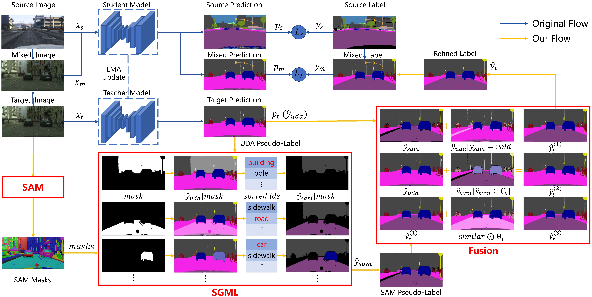

# SAM4UDASS: When SAM meets unsupervised domain adaptive segmantic segmentation

This is the official implementation of our paper "SAM4UDASS: When SAM meets unsupervised domain adaptive segmantic segmentation".

## News

Our paper is accepted by IEEE Transactions on Intelligent Vehicles on December 15, 2023. 🔔🔔🔔🎉🎉🎉

[SAM4UDASS: When SAM Meets Unsupervised Domain Adaptive Semantic Segmentation in Intelligent Vehicles | IEEE Journals &amp; Magazine | IEEE Xplore](https://ieeexplore.ieee.org/document/10366854)

## Abstract

Semantic segmentation plays a critical role in enabling intelligent vehicles to comprehend their surrounding environments. However, deep learning-based methods usually perform poorly in domain shift scenarios due to the lack of labeled data for training. Unsupervised domain adaptation (UDA) techniques have emerged to bridge the gap across different driving scenes and enhance model performance on unlabeled target environments. Although self-training UDA methods have achieved state-of-the-art (SOTA) results, the challenge of generating precise pseudo-labels persists. These pseudo-labels tend to favor majority classes, consequently sacrificing the performance of rare classes or small objects like traffic lights and signs. To address this challenge, we introduce SAM4UDASS, a novel approach that incorporates the Segment Anything Model (SAM) into self-training UDA methods for refining pseudo-labels. It involves Semantic-Guided Mask Labeling, which assigns semantic labels to unlabeled SAM masks using UDA pseudo-labels. Furthermore, we devise fusion strategy aimed at mitigating semantic granularity inconsistency between SAM masks and the target domain. SAM4UDASS innovatively integrate segmentation foundation model SAM with UDA for semantic segmentation in driving scenes and seamlessly complements self-training UDA methods. Extensive experiments on synthetic-to-real, normal-to-adverse, and pinhole-to-panoramic driving datasets demonstrate its effectiveness. It brings
more than 3% mIoU gains on GTA5-to-Cityscapes, SYNTHIA-to-Cityscapes, and Cityscapes-to-ACDC when using DAFormer and achieves SOTA when using MIC. The code is available at https://github.com/ywher/SAM4UDASS.

## Method Overview



## Environment Setup

## Dataset Preparation

## Usage Example

## Acknowledgement

## Citation

> ```
> @ARTICLE{10366854,
>   author={Yan, Weihao and Qian, Yeqiang and Zhuang, Hanyang and Wang, Chunxiang and Yang, Ming},
>   journal={IEEE Transactions on Intelligent Vehicles}, 
>   title={SAM4UDASS: When SAM Meets Unsupervised Domain Adaptive Semantic Segmentation in Intelligent Vehicles}, 
>   year={2024},
>   volume={9},
>   number={2},
>   pages={3396-3408},
>   keywords={Semantics;Semantic segmentation;Training;Intelligent vehicles;Task analysis;SGML;Predictive models;Intelligent vehicles;semantic segmentation;domain adaptation;segment anything model},
>   doi={10.1109/TIV.2023.3344754}}
> ```
>

## Contact

Weihao Yan: weihao_yan@outlook.com

## TO DO

* [ ] Organize the code and upload it
* [ ] Detailed readme writing
* [ ] Open-source the trained model
